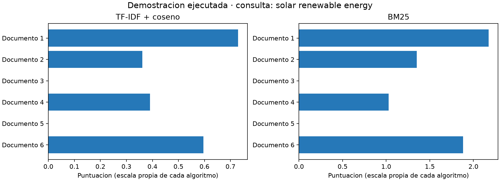

# Buscador de documentos con TF-IDF y BM25

Proyecto académico de recuperación de información: compara dos métodos clásicos para ordenar documentos según una consulta. Incluye una interfaz web con Flask y evaluación sobre el corpus ArguAna.

## Demostración visual ejecutada

La figura se generó ejecutando 	fidf_search y m25_search sobre seis documentos de ejemplo. No es una evaluación del corpus ArguAna: muestra cómo cambia la puntuación por documento. Cada algoritmo usa su propia escala.



Para regenerarla después de instalar las dependencias: python generar_figura_demo.py.

## Qué hace

- Preprocesa texto en inglés: normalización, stopwords, stemming y lematización.
- Compara TF-IDF con similitud coseno frente a BM25.
- Presenta los diez documentos mejor clasificados.
- Calcula precisión@10, recall@10 y AP@10 cuando la consulta corresponde a una consulta evaluada del corpus. El código histórico llama MAP a esa AP de una consulta; no es una media entre consultas.

## Tecnologías y estructura

Python, Flask, pandas, NumPy, scikit-learn, NLTK, spaCy e ir_datasets.

```text
preparar_datos.py                     Descarga y prepara ArguAna
preprocessing.py                     Preprocesamiento de consultas
retrieval.py                         TF-IDF y BM25
evaluation.py                        Métricas de recuperación
web_app_auto_queryid_preprocessed.py  Interfaz web principal
cli_app.py                           Ejemplo de consola
data/                                Archivos generados, fuera de Git
```

## Instalación

Se recomienda Python 3.11 y un entorno virtual. Desde la raíz del repositorio:

```bash
python -m venv .venv
# Windows PowerShell:
.venv/Scripts/Activate.ps1
# Linux/macOS, en lugar de la línea anterior:
# source .venv/bin/activate
python -m pip install -r requirements.txt
python -m spacy download en_core_web_sm
```

## Preparar datos y ejecutar

```bash
python preparar_datos.py
python web_app_auto_queryid_preprocessed.py
```

Abre http://127.0.0.1:5000, escribe una consulta en inglés y selecciona el método. Para observar métricas de relevancia, utiliza el texto de una consulta de `data/queries.tsv`. Una consulta libre puede recuperar documentos, pero no tiene relevancias de referencia; los ceros de la interfaz no representan una evaluación de esa consulta.

## Por qué los datos no están en GitHub

El corpus y los recursos de lenguaje se descargan en la computadora que ejecuta el proyecto. Así el repositorio conserva el código y el procedimiento para reconstruir el experimento. La primera preparación necesita Internet y puede tardar.

## Limitaciones y créditos

Implementación académica: reconstruye representaciones por consulta y no está optimizada para producción. El preprocesamiento está configurado para inglés. ArguAna se obtiene mediante `ir_datasets`; los datos y modelos mantienen sus condiciones y autorías originales. Las variantes `web_app.py` y `web_app_debug.py` se conservan como alternativas; los pasos anteriores usan una única entrada principal.

Publicado en el portafolio de [Anthony Reinoso](https://github.com/TAnthonyR). No se atribuye la autoría del corpus ni de las bibliotecas.
